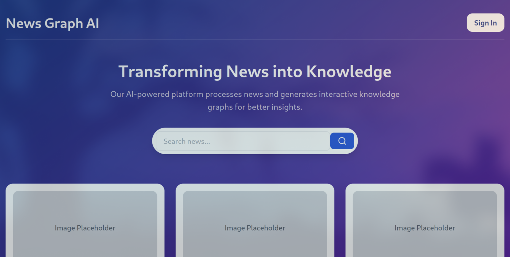
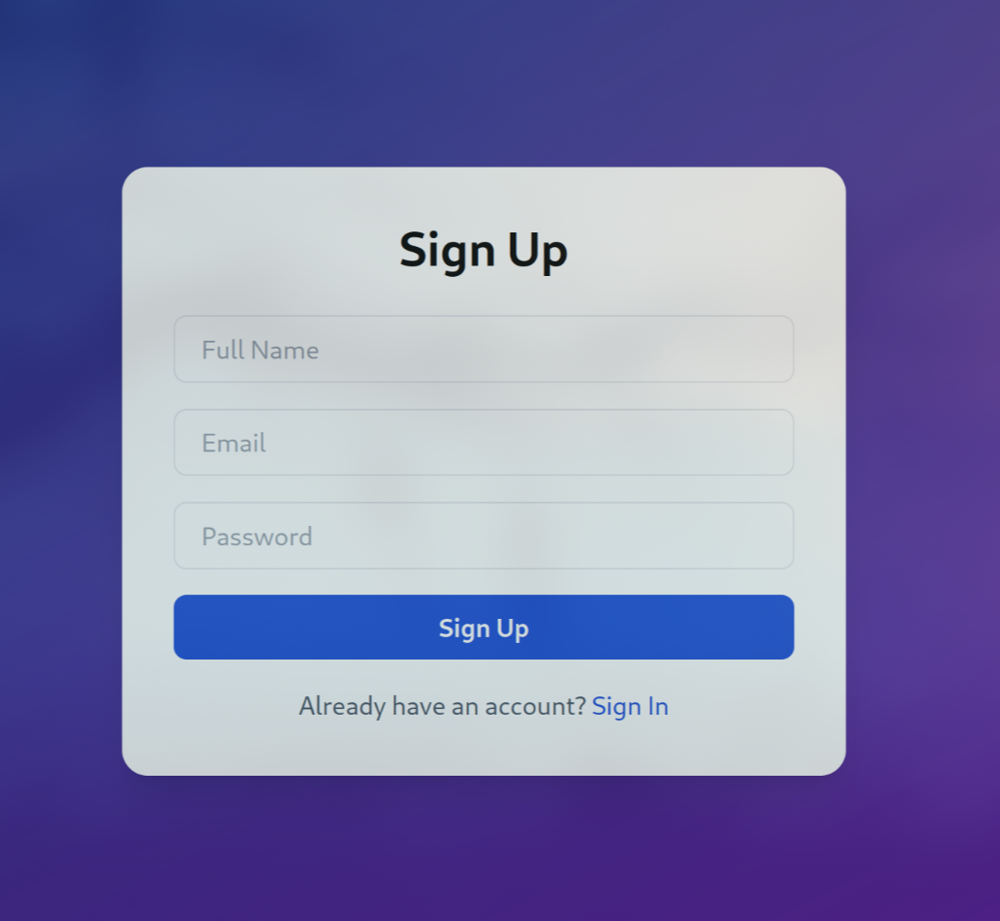
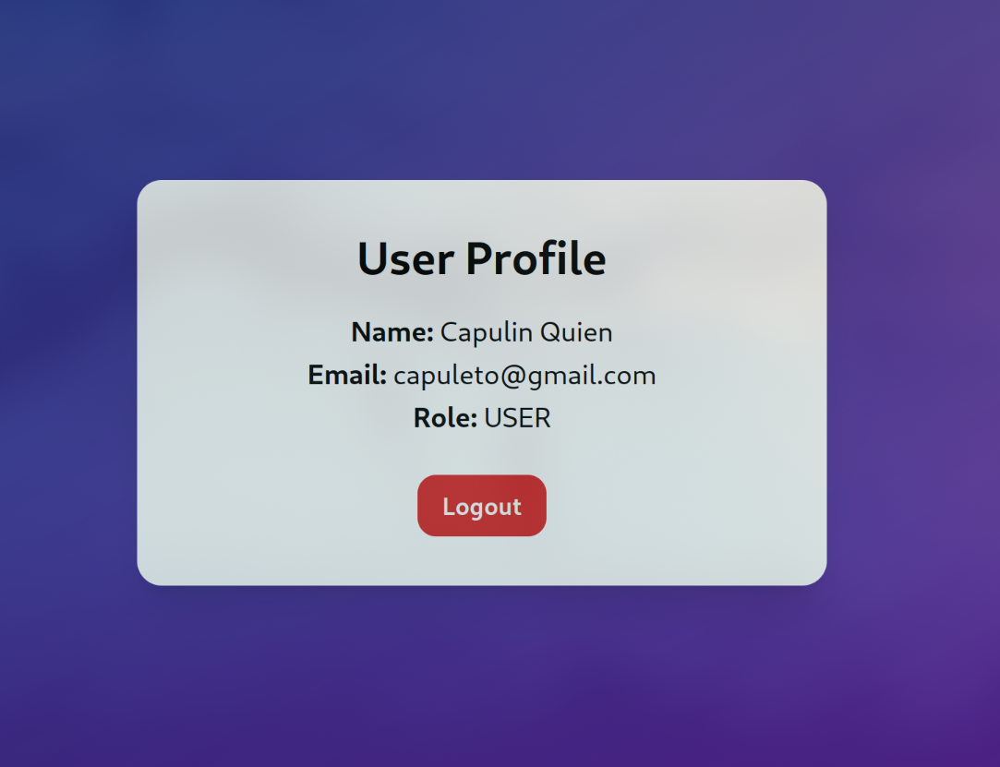
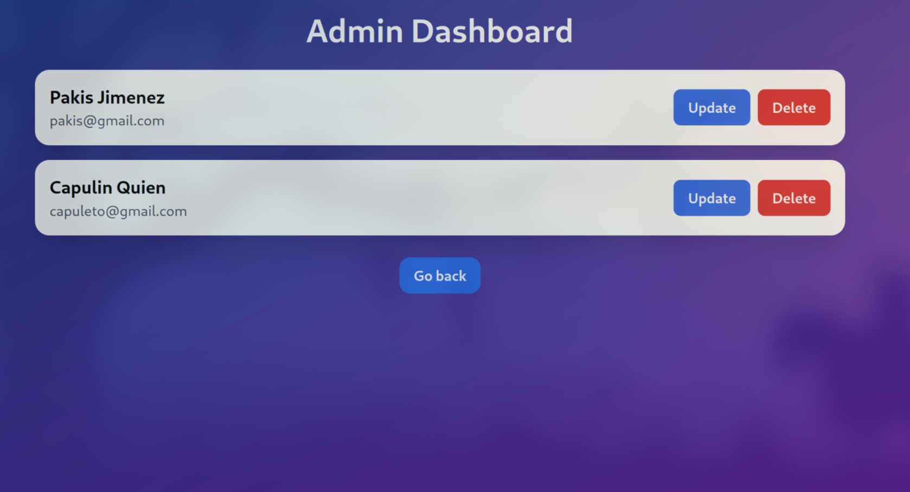
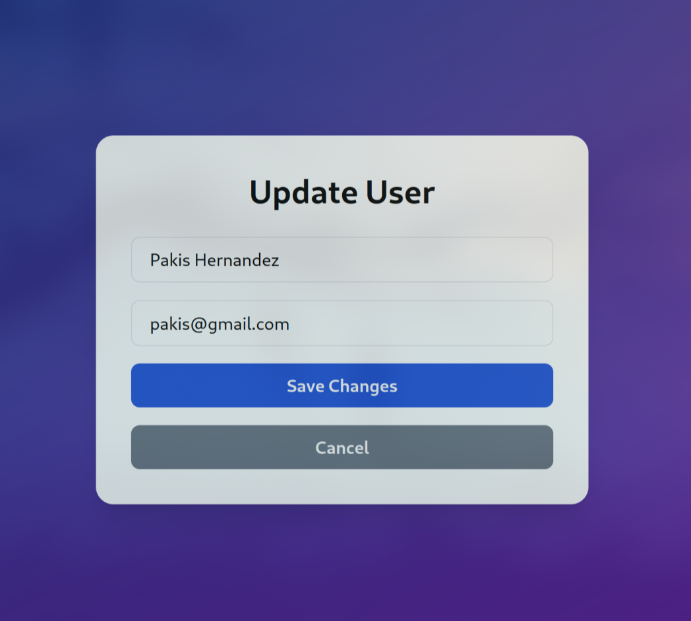
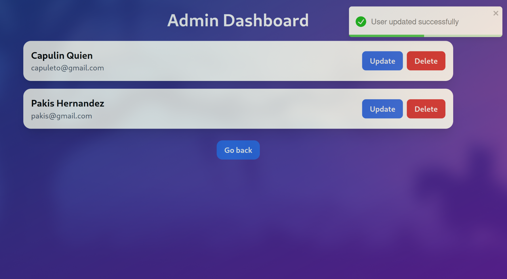
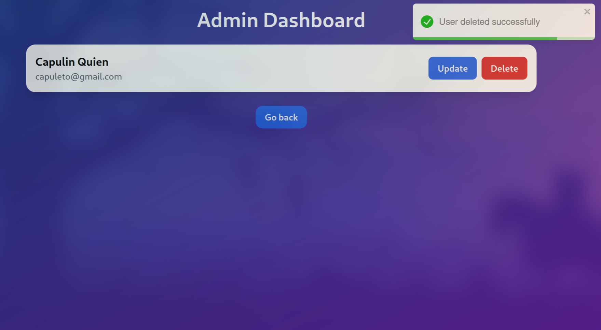

<p align="center">
    <h1 align="center">Graph News</h1>
</p>
<p align="center">
    <em>This project is a web app that analyzes news and generetes knowledge graphs</em>
</p>
<p align="center">
	
	
	
	
<p>

<p align="center">
		<em>Developed with the software and tools below.</em>
</p>
<p align="center">
  
	
	
	
	
	
	
	
</p>
<hr>

## 🔗 Quick Links

> - [🤟 Contributors](#-contributors)
> - [📦 Features](#-features)
> - [🧩 API REST](#-api-rest)
> - [🚀 Getting Started](#-getting-started)
>   - [⚙️ Installation](#️-installation)
>   - [🤖 Running graph-news](#-running-curi-store)
>   - [🧪 Environment variables](#-env)
> - [🛠 Project Roadmap](#-project-roadmap)
> - [🤝 Contributing](#-contributing)
> - [📸 Screenshots](#-screenshots)

---

## 🤟 Contributors

<a href="https://github.com/irmindev/REPO/graphs/contributors">
  
  
  
  
</a>


## 📦 Features

In this project these are the highlitghted features:
- API authorization required
- Authorization using JWT
- Backend using spring boot and frontend using react
- JWT sessions

## 🧩 API REST

In the graph-news-backend folder you have a spring boot project, this project is a web API Rest for the graph news app. These are the endpoints.

**URL**: `/api/user/{id}`
**Method**: `GET`
**Parameters**:
> | name      |  type     | data type               | description                                                           |
> |-----------|-----------|-------------------------|-----------------------------------------------------------------------|
> | id      |  required | String   | Is the ID needed to do the query, this ID must be on the URL.  |
> | token      |  required | String   | The token is the JWT generated in each session, it must to be in the Authorization headers using Bearer.  |

**Responses**:

> | http code     | content-type                      | response                                                            |
> |---------------|-----------------------------------|---------------------------------------------------------------------|
> | `400`         | `application/json`    | `{"message":"Invalid token"}` |      
> | `403`         | `application/json`    | `{"message":"Token expired"`  |
> | `401`         | `application/json`    | `{"message":"The id in the token does not match the requested id or is not an ADMIN user"}`                            |
> | `200`         | `application/json`    | `{message: 'Success', user: {...}}`                      |

**Example response**:
```js
{
  message: 'Success',
  user: {
    id: 1,
    name: 'Frijolito Hernandez',
    email: 'Frijolito@gmail.com',
    role: 'USER'
  },
}
```
---
**URL**: `/api/user/signup`
**Method**: `POST`
**Parameters**:
> | name      |  type     | data type               | description                                                           |
> |-----------|-----------|-------------------------|-----------------------------------------------------------------------|
> | name      |  required | String   | The name is the name of the user yo want to register.  |
> | email      |  required | String   | The email is part of the credentials needed to login.  |
> | password      |  required | String   | The password is the key you want to use for your account.  |


**Responses**:

> | http code     | content-type                      | response                                                            |
> |---------------|-----------------------------------|---------------------------------------------------------------------|
> | `400`         | `application/json`    | `{"message":"Email already used"}` |
> | `200`         | `application/json`    | `{message: 'Success', user: {...}, token: '...'}`                      |
**Example request**:
```js
{
  name: 'Frijolito Hernandez',
  email: 'Frijolito@gmail.com',
  password: '12345678'
}
```

**Example response**:
```js
{
  message: 'Success',
  user: {
    id: 1,
    name: 'Frijolito Hernandez',
    email: 'Frijolito@gmail.com',
    role: 'USER'
  },
  token: '...'
}
```
---
**URL**: `/api/user/login`
**Method**: `POST`
**Parameters**:
> | name      |  type     | data type               | description                                                           |
> |-----------|-----------|-------------------------|-----------------------------------------------------------------------|
> | email      |  required | String   | The email is part of the credentials needed to login.  |
> | password      |  required | String   | The password is the key you want to use for your account.  |


**Responses**:

> | http code     | content-type                      | response                                                            |
> |---------------|-----------------------------------|---------------------------------------------------------------------|
> | `400`         | `application/json`    | `{"message":"Incorrect credentials"}` |
> | `200`         | `application/json`    | `{message: 'Success', user: {...}, token: '...'}`                      |
**Example request**:
```js
{
  email: 'Frijolito@gmail.com',
  password: '12345678'
}
```

**Example response**:
```js
{
  message: 'Success',
  user: {
    id: 1,
    name: 'Frijolito Hernandez',
    email: 'Frijolito@gmail.com',
    role: 'USER'
  },
  token: '...'
}
```
---
**URL**: `/api/user/all`
**Method**: `POST`
**Parameters**:
> | name      |  type     | data type               | description                                                           |
> |-----------|-----------|-------------------------|-----------------------------------------------------------------------|
> | token      |  required | String   | The token is the JWT generated in each session, it must to be in the Authorization headers using Bearer and the user must to be ADMIN.  |

**Responses**:

> | http code     | content-type                      | response                                                            |
> |---------------|-----------------------------------|---------------------------------------------------------------------|
> | `403`         | `application/json`    | |
> | `200`         | `application/json`    | `{message: 'Success', user: [...]}`|


**Example response**:
```js
{
  message: 'Success',
  users: [
    {
      id: 1,
      name: 'Frijolito Hernandez',
      email: 'Frijolito@gmail.com',
      role: 'USER'
    },
    {
      id: 2,
      name: 'Pakis Jimenez',
      email: 'pakis@gmail.com',
      role: 'ADMIN'
    }
  ]
}
```
---

**URL**: `/api/user/{id}`
**Method**: `DELETE`
**Parameters**:
> | name      |  type     | data type               | description                                                           |
> |-----------|-----------|-------------------------|-----------------------------------------------------------------------|
> | id      |  required | String   | Is the ID needed to do the query, this ID must be on the URL.  |
> | token      |  required | String   | The token is the JWT generated in each session, it must to be in the Authorization headers using Bearer.  |

**Responses**:

> | http code     | content-type                      | response                                                            |
> |---------------|-----------------------------------|---------------------------------------------------------------------|
> | `403`         | `application/json`    | |
> | `410`         | `application/json`    | `{"message":"Entity not found"`  |
> | `200`         | `application/json`    | `{message: 'Success', user: {...}}`                      |

**Example response**:
```js
{
  message: 'Success',
  user: {
    name: 'Frijolito Hernandez',
    email: 'frijol@gmail.com',
    role: 'USER'
  }
}
```
---
**URL**: `/api/user/{id}`
**Method**: `PUT`
**Parameters**:
> | name      |  type     | data type               | description                                                           |
> |-----------|-----------|-------------------------|-----------------------------------------------------------------------|
> | name      |  required | String   | The name is the new name of the user yo want to update.  |
> | email      |  required | String   | The email is the new email that you want to update.  |
> | id      |  required | String   | Is the ID needed to do the query, this ID must be on the URL.  |
> | token      |  required | String   | The token is the JWT generated in each session, it must to be in the Authorization headers using Bearer.  |


**Responses**:

> | http code     | content-type                      | response                                                            |
> |---------------|-----------------------------------|---------------------------------------------------------------------|
> | `400`         | `application/json`    | `{"message":"Invalid token"}` |      
> | `401`         | `application/json`    | `{"message":"The id in the token does not match the requested id or is not an ADMIN user"}`                            |
> | `403`         | `application/json`    | `{"message":"Token expired"`  |
> | `409`         | `application/json`    | `{"message":"Email already used"`  |
> | `410`         | `application/json`    | `{"message":"Entity not found"`  |
> | `200`         | `application/json`    | `{message: 'Success', user: {...}}`                      |
**Example request**:
```js
{
  name: 'Frijolito Hernandez',
  email: 'Frijolito@gmail.com',
}
```

**Example response**:
```js
{
  message: 'Success',
  user: {
    id: 1,
    name: 'Frijolito Hernandez',
    email: 'Frijolito@gmail.com',
    role: 'USER'
  }
}
```

---

## 🚀 Getting Started

***Requirements***

Ensure you have the following dependencies installed on your system:

* **Docker**: `version 28.0.0`
* **Docker-compose**: `version 2.33.1`
* **Docker-buildx**: `version 0.21.0`

### ⚙️ Installation

1. Clone the curi-store repository:

```sh
git clone https://github.com/IrminDev/graph-news
```

2. Change to the project directory:

```sh
cd graph-news
```

### 🤖 Running graph news

Use the following commands to run the frontend, backend and the db:

```sh
docker-compose up --build
```

If you want to create an `ADMIN` user manually, you need to run the following commands:

```sh
docker exec -it your_container_name bash
psql -U irmin -d graph-news
<<Prompt the password: irmin>>
UPDATE Users SET role = 1 WHERE email = <your_email>;
\q
exit
```
Where the email is the email of the user that you want to grant the `ADMIN` role.


### 🧪 Environment variable

To run this project, you will need to add the following environment variables to your .env file inside curistore-backend

#### 💾 Database container

`POSTGRES_USER`: User in postgres container.

`POSTGRES_PASSWORD`: Password for the user.

`POSTGRES_DB`: Database that you will use.

#### 🖥️ Backend container

`PORT`: Port of the app.

`DATABASE_URL`: Is the url to connect into the DB.

`DATABASE_USER`: Must be the same to the user configured in the db.

`DATABASE_PASSWORD`: Must be the same to the password configured in the db.

`JWT_SECRET`: Is the JWT secret key used.

`JWT_EXPIRATION`: Is the time expiration for each token in miliseconds.


#### 💫 Frontend container

`NGINX_PORT`: Is the port for the nginc server

---

## 🛠 Project Roadmap

- [X] `> Added folder structure`
- [X] `> Added the frontend`
- [X] `> Added the backend`
- [X] `> Connected the backend with the frontend`

---

## 🤝 Contributing

Contributions are welcome! Here are several ways you can contribute:

- **[Submit Pull Requests](https://github.com/IrminDev/graph-news/pulls)**: Review open PRs, and submit your own PRs.
- **[Join the Discussions](https://github.com/IrminDev/graph-news/discussions)**: Share your insights, provide feedback, or ask questions.
- **[Report Issues](https://github.com/IrminDev/graph-news/issues)**: Submit bugs found or log feature requests for Curi-store.

<details closed>
    <summary>Contributing Guidelines</summary>

1. **Fork the Repository**: Start by forking the project repository to your GitHub account.
2. **Clone Locally**: Clone the forked repository to your local machine using a Git client.
   ```sh
   git clone https://github.com/IrminDev/graph-news
   ```
3. **Create a New Branch**: Always work on a new branch, giving it a descriptive name.
   ```sh
   git checkout -b new-feature-x
   ```
4. **Make Your Changes**: Develop and test your changes locally.
5. **Commit Your Changes**: Commit with a clear message describing your updates.
   ```sh
   git commit -m 'Implemented new feature x.'
   ```
6. **Push to GitHub**: Push the changes to your forked repository.
   ```sh
   git push origin new-feature-x
   ```
7. **Submit a Pull Request**: Create a PR against the original project repository. Clearly describe the changes and their motivations.

Once your PR is reviewed and approved, it will be merged into the main branch.

</details>

---

## 📸 Screenshots

The screenshots of the functionalities are:

### Index Page


### Sign in Page


## Sign up Page


## Profile Page


## Dashboard Page


## Update Page


## User updated


## User deleted
