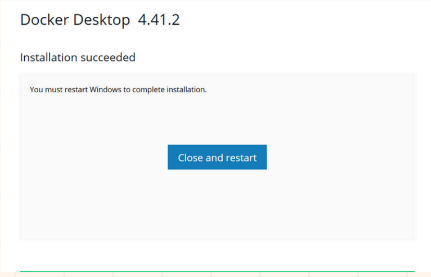

<h1>Graph News Tutorial</h1>
Docker is required to execute Graph-News
<h2>Docker Tutorial</h2>

First of all, Docker Desktop must be downloaded from the Docker Official Web Page

After it was downloaded, the .exe must be executed.

After your computer was restarted, you need to configurate docker, it's recommended to use the default configuration.

It's needed to sign in with an account, we suggest to sign in with the Github account.

When you see this interface, Docker has been downloaded and configurated successfully.
<h2>Clone the repository</h2>
You need to clone the repository, the link is https://github.com/IrminDev/graph-news.git

<h2>Executing the docker</h2>
Go to the folder where you cloned the repository and then execute in the terminal docker compose up --build, you don't need to change the settings.

The docker container, the images, and the volumes will be created.

After you see this, it means that Graph News has started
You can see the it in localhost:5173

To make sure that is running the server, you can use postman to ensure that the endpoints are working

The url path is http://localhost:8080/api/user/signin
and the json is 
{
    "name": "juanito",
    "email": "juanito2@gmail.com",
    "password": "juanito"
}
You can change the name, email, password.
And after that, execute, and the user is gonna be created.

You can upload a news by the url from another web page, a file or a text, in this case we are uploading a news from a text.

After you upload the news, you can see the graph that's generated from the news

